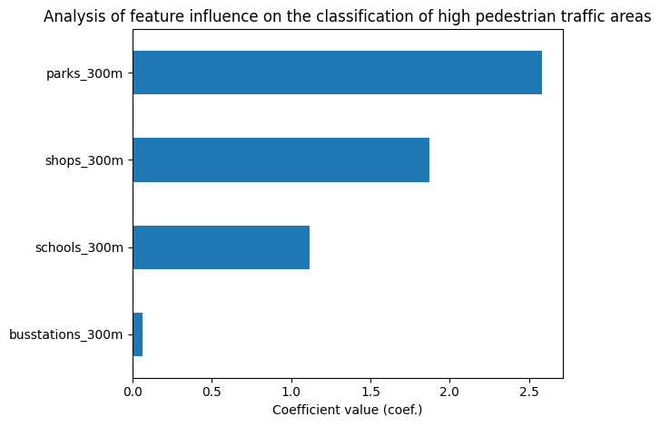
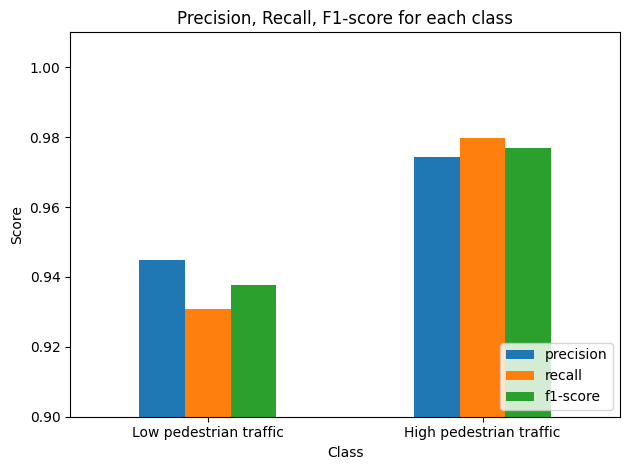

# Identification places of high pedestrian traffic based on OpenStreetMap data and Machine Learning

### Description of the project

This project aims to identify areas with high potential pedestrian traffic in the city of Olsztyn, based on publicly available spatial data from OpenStreetMap and simple machine learning models. All major steps are designed to be generalizable and can be easily adapted to other cities or regions in Poland.

### Technologies and Libraries Used

- **Python (3.x)** — core project language.
- **osmnx** — acquisition and processing of OSM data (street networks, POIs).
- **pandas** — data frame manipulation and preprocessing.
- **geopandas** — geospatial data analysis and spatial operations.
- **scikit-learn** — machine learning (logistic regression, train/test split, model evaluation).
- **matplotlib** — plotting statistical charts and maps.
- **contextily** — adding web map basemaps to geospatial visualizations.
- **matplotlib.patheffects** — enhanced graphic effects for matplotlib annotations.
- **adjustText** — automatic label adjustment for clear map/data visualisation.

### Main Steps of the Solution

- Download and process the pedestrian street network using OSMNx.

- Retrieve Points of Interest (POIs) from OpenStreetMap.

- Extract spatial features around network nodes.

- Construct the target variable (label: does this location generate high pedestrian traffic?).

- Train and evaluate a classification model.

- Interpret the results and visualize them on a map.

### Imports
```python
import osmnx as ox
import pandas as pd
import geopandas as gpd
from sklearn.model_selection import train_test_split
from sklearn.linear_model import LogisticRegression
from sklearn.metrics import classification_report, confusion_matrix, ConfusionMatrixDisplay
import matplotlib.pyplot as plt
import contextily as ctx
import matplotlib.patheffects as PathEffects
from adjustText import adjust_text
```
### 1. Download and process the pedestrian street network using OSMNx

```python
G = ox.graph_from_place('Olsztyn, Poland', network_type='walk')
nodes, edges = ox.graph_to_gdfs(G)

```
### Description
This section downloads the pedestrian street network from OpenStreetMap and converts it into GeoDataFrames containing nodes and edges.

- `nodes` - represent points in the network (e.g. intersections, sidewalk entry points).
- `edges` - correspond to segments of streets and paths.

### 2. Retrieve Points of Interest (POIs) from OpenStreetMap

```python
tags = {
    'amenity': ['school', 'bus_station'],
    'shop': True,
    'leisure': ['park']
}
pois = ox.features.features_from_place('Olsztyn, Poland', tags)
```
### Description
Retrieves Points of Interest (POIs) such as schools, shops, bus stops ans parks from OpenStreetMap for Olsztyn and stores them in a GeoDataFrame.

### 3. Set a consistent Coordinate Reference System (CRS)

```python
nodes = nodes.to_crs(2180)
pois = pois.to_crs(2180)
```
### Description
CRS is converted to a metric system to allow accurate distance measurements.

### 4. Compute features for each node based on the number of POIs within a 300 meter radius

```python
def count_poi_around_node(node_gdf, poi_gdf, buffer=300, filter_column=None, filter_value=None):
    if filter_column:
        if filter_value:
            selected = poi_gdf[poi_gdf[filter_column] == filter_value]
        else:
            selected = poi_gdf[poi_gdf[filter_column].notnull()]
    else:
        selected = poi_gdf
    counts = []
    for geom in node_gdf.geometry:
        counts.append(selected[selected.distance(geom) < buffer].shape[0])
    return counts

nodes['schools_300m'] = count_poi_around_node(nodes, pois, 300, 'amenity', 'school')
nodes['shops_300m'] = count_poi_around_node(nodes, pois, 300, 'shop')

nodes['busstations_300m'] = count_poi_around_node(nodes, pois, 300, 'amenity', 'bus_station')
nodes['parks_300m'] = count_poi_around_node(nodes, pois, 300, 'leisure', 'park')
```
### Description
This function counts the number of POIs of each selected type within a 300 meters distance from each node and saves these values as feature columns.

### 5. Create the target variable

```python
nodes['high_pedestrian'] = (
    (nodes['schools_300m'] > 1) | 
    (nodes['shops_300m'] > 3) | 
    (nodes['busstations_300m'] > 1)
).astype(int)
```
### Description
Generates a classification label that marks whether a location is likely to produce high pedestrian traffic.

### 6. Prepare data for training the Machine Learning model

```python
feature_cols = ['schools_300m', 'shops_300m', 'busstations_300m', 'parks_300m']
X = nodes[feature_cols].fillna(0)
y = nodes['high_pedestrian']
X_train, X_test, y_train, y_test = train_test_split(X, y, test_size=0.2, random_state=42)
```
### Description
Initialize X variable to hold the input features and y to hold the target labels, and split data into training sets and test sets.

### 7. Initialize and train the model

```python
model = LogisticRegression()
model.fit(X_train, y_train)
```
### Description
Initialize Logistic Regression model and train it on training data.

### 8. Make predictions using the model on the test data

```python
y_pred = model.predict(X_test)
```
### Description
The predictions made on the test data will be necessary for analyzing the model's performance metrics.

### 9. Create a column with model predictions for all data

```python
nodes['model_pred'] = model.predict(X)
```
### Description
This column will be required for visualizing the final output on the map

### 10. Retrieving district/neighbourhood polygons of Olsztyn

```python
tags = {"place": ["suburb", "neighbourhood"]}
districts = ox.features.features_from_place("Olsztyn, Poland", tags)
print(districts[['name']])
```
### Description
Retrieves geometry and attributes for all Olsztyn areas tagged in OSM as place=suburb or place=neighbourhood. The resulting GeoDataFrame contains e.g. the name column with the district/neighbourhood name.

### 11. Coordinate reference system (CRS) conversion

```python
districts = districts.to_crs(nodes.crs)
districts = districts.to_crs(epsg=3857)
nodes = nodes.to_crs(epsg=3857)
```
### Description
At the beginning, we ensure that all spatial data (districts and nodes) share the same coordinate reference system (CRS). Then, a final CRS conversion to EPSG:3857 is performed to align the data with the basemap used for visualizing the district layout of Olsztyn.

### 12. Plotting the map of high pedestrian traffic

```python
districts = districts.dropna(subset=["name"]).copy()
districts_unique = districts.drop_duplicates(subset="name").copy()
districts_unique['centroid'] = districts_unique.geometry.centroid

fig, ax = plt.subplots(figsize=(16, 16), dpi=200)

districts_unique.plot(ax=ax, facecolor="none", edgecolor="black", linewidth=1, alpha=0.7, zorder=2)
districts_unique.boundary.plot(ax=ax, color='black', linewidth=1, zorder=4)

nodes.plot(
    column="model_pred", ax=ax, cmap="coolwarm", legend=True,
    markersize=2, legend_kwds={'label': 'Pedestrian traffic intensity', 'shrink': 0.6}, zorder=3
)
ctx.add_basemap(ax, source=ctx.providers.OpenStreetMap.Mapnik, zoom=16, alpha=0.7)

districts_unique.set_geometry('centroid').plot(
    ax=ax,
    markersize=120,
    color='yellow',
    marker='o',
    edgecolor='black',
    linewidth=2,
    zorder=10,
    alpha=1
)

texts = []
for idx, row in districts_unique.iterrows():
    x, y = row['centroid'].x, row['centroid'].y
    label = str(row['name'])
    txt = ax.text(
        x, y, label, fontsize=12, ha="center", va="center",
        color="black", weight="bold", zorder=20,
    )
    txt.set_path_effects([
        PathEffects.withStroke(linewidth=2, foreground='white')
    ])
    texts.append(txt)

adjust_text(
    texts, ax=ax,
    expand_points=(2.2, 2.2),
    arrowprops=dict(arrowstyle="-|>", color='black', lw=3, alpha=0.7)
)

ax.set_axis_off()
plt.title(
    "Visualization of the predicted pedestrian traffic intensity within Olsztyn’s street network, aggregated by district boundaries",
    fontsize=18
)
plt.tight_layout()
plt.show()
```


## Analyze the model metrics

### 1. Initialize confusion matrix

```python
conf_matrix = confusion_matrix(y_test, y_pred)
```
### Description
Initialize the confusion matrix with test and predicted data.

### 2. Plotting confusion matrix
```python
disp = ConfusionMatrixDisplay(confusion_matrix=conf_matrix, display_labels=model.classes_)
fig, ax = plt.subplots(figsize=(6,6))
disp.plot(ax=ax, cmap='Blues', values_format='d')
plt.title("Confusion Matrix")
plt.show()
```


### Analysis
Confusion matrix analysis revealed the following classification results:

- TP (True Positives) = 3110 – correctly classified cases of high pedestrian traffic

- TN (True Negatives) = 1266 – correctly classified cases of low pedestrian traffic

- FP (False Positives) = 64 – incorrectly classified low pedestrian traffic cases as high pedestrian traffic

- FN (False Negatives) = 23 – incorrectly classified high pedestrian traffic cases as low pedestrian traffic

### 1. Plotting feature importance in classifying high pedestrian traffic

```python
coeffs = pd.Series(model.coef_[0], index=feature_cols)
coeffs.sort_values().plot(kind='barh')
plt.title('Analysis of feature influence on the classification of high pedestrian traffic areas')
plt.xlabel('Coefficient value (coef.)')
plt.tight_layout()
plt.show()
```

### Analysis
Confusion matrix analysis revealed the following classification results:

- shops_300m (shops within 300 meters) Shops have the strongest impact on classifying an area as high pedestrian traffic. This result is consistent with expectations, as the presence of shops is a strong attractor of pedestrian activity.

- schools_300m (schools within 300 meters) While schools significantly contribute to the classification of high pedestrian traffic areas, shops exhibit the strongest overall effect. The presence of schools contributes to regular foot traffic, primarily driven by students and accompanying parents.

- busstations_300m (bus stops within 300 meters) This feature demonstrates minimal predictive influence, as evidenced by its near-zero coefficient value. This suggests that the presence of a bus stop alone does not imply increased pedestrian traffic, especially in the absence of other surrounding urban elements.

- parks_300m (parks within 300 meters) The absence of a visible bar suggests a coefficient close to zero, or possibly exactly zero. This may indicate that parks in the dataset did not attract a sufficient number of pedestrians.

### 1. Initialize classification report

```python
classify_report = classification_report(y_test, y_pred, output_dict=True)
```
### Description
Initialize the classification report with test and predicted data.

### 2. Plotting classification report

```python
df_report = pd.DataFrame(classify_report).transpose()
df_report_classes = df_report.loc[['0', '1'], ['precision', 'recall', 'f1-score']]

df_report_classes.plot(kind='bar', ylim=(0.9, 1.01))
plt.title('Precision, Recall, F1-score for each class')
plt.ylabel('Score')
plt.xlabel('Class')
plt.xticks([0,1], ['Low pedestrian traffic', 'High pedestrian traffic'], rotation=0)
plt.legend(loc='lower right')
plt.tight_layout()
plt.show()
```


### Analysis
Low pedestrian traffic
- Model precision is very high - when model classify low pedestrian traffic, it's correct about 98% of the time.
- Recall is slightly lower - model occasionally overlooks low-traffic areas.
- F1 Score is solid, though a bit lower because the model misses some low-traffic areas.
  
High pedestrian traffic
- Precision is very high – the model is highly accurate when identifying areas of high pedestrian activity.
- Recall is even higher – the model successfully identifies almost all high-traffic locations.
- F1 Score is excellent – the model demonstrates strong accuracy and reliability in detecting high pedestrian traffic zones.

## Feedback, Issues & Collaboration

### Share Your Feedback

I highly value all feedback — technical, geospatial, or user-experience-related.  
If you found this project useful, insightful, or have ideas for improvement, please let me know!

**You can:**
- Open a discussion or issue in this repository (use label "Feedback" or "Suggestion"),
- Connect with me on [LinkedIn](https://www.linkedin.com/in/kacper-litwińczyk-0714ab350/)

---

### Reporting Issues and Bugs

If you encounter any bugs, unexpected errors, or documentation issues:
- Please open a GitHub issue and describe the problem (including error messages and environment details if possible).
- Pull requests with fixes or enhancements are always welcome!

Reporting issues helps continually improve the quality and usefulness of this project.

---

### Collaboration & Further Development

Interested in:
- Extending this project (e.g., more features, supporting more cities, creating interactive dashboards)?
- Applying a similar workflow in your own organization or city?
- Collaborating on research, journal publication, or conference presentations?

**Let's work together!**
Feel free to propose collaboration through GitHub or LinkedIn.  
I'm open to teamwork on open-source, research, or commercial geo-analytics projects.

---

Thank you for checking out this project!  


